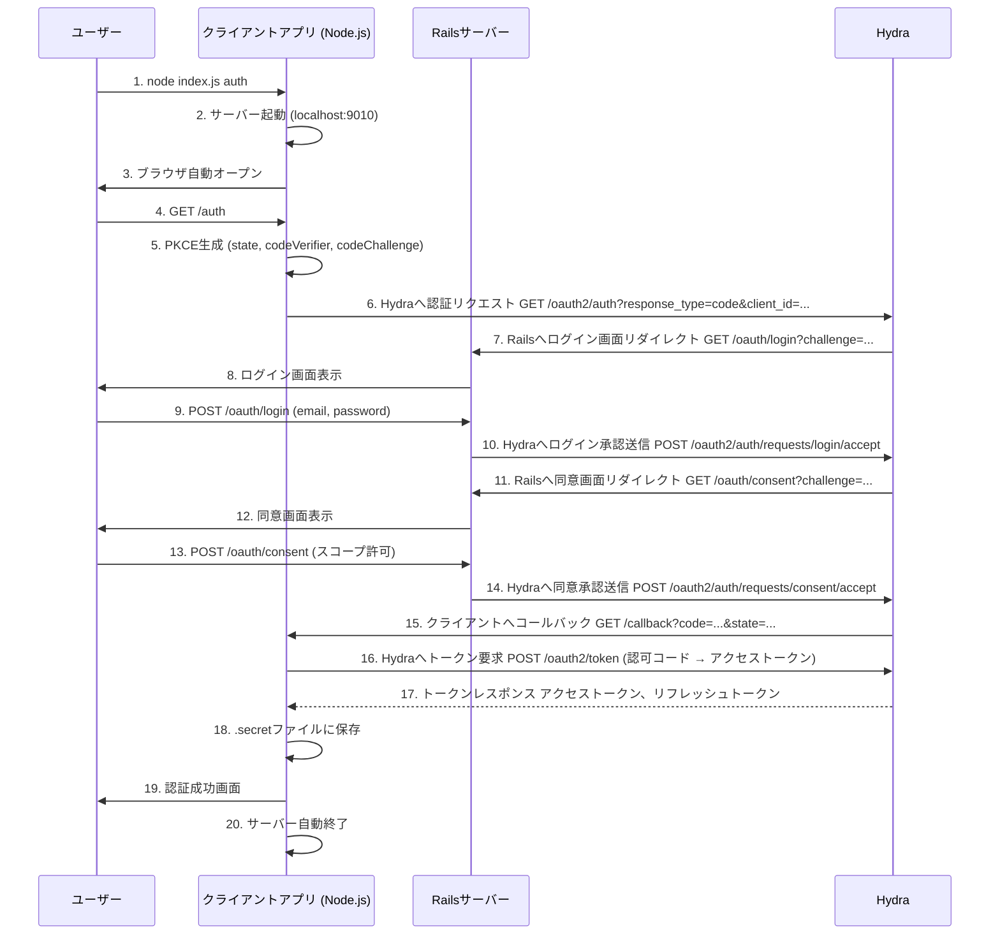
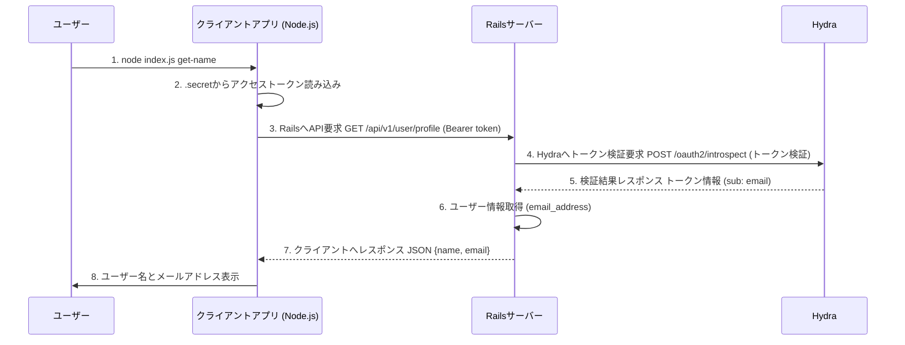

# OAuth 2 Test

## OAuth 2.0 基本概念

### 認証と認可の違い

**認証（Authentication）**
ユーザーが「本人である」ことを確認するプロセス
例）Webサイトにログインするときに、ユーザー名とパスワードを入力する

**認可（Authorization）**
あるユーザーやアプリが「特定のデータや機能にアクセスできる」ことを許可するプロセス
例）Googleアカウントを使って外部アプリにカレンダーの予定を読み取る権限を与える

### OAuth 2.0の登場人物

**リソースオーナー（Resource Owner）**
- 保護されたリソースの所有者（通常はユーザー）
- リソースへのアクセスを認可する権限を持つ
- 例：写真やカレンダーデータを持つユーザー

**クライアント（Client）**
- リソースオーナーの代わりにリソースにアクセスするアプリケーション
- リソースオーナーの認可を得てからリソースサーバーにアクセス
- 例：Node.jsで作成したOAuth2クライアント

**認可サーバー（Authorization Server）**
- リソースオーナーを認証し、認可を取得した後にアクセストークンを発行
- OAuth 2.0の中核となるサーバー
- 例：Hydra

**リソースサーバー（Resource Server）**
- 保護されたリソースをホストし、アクセストークンを使ってリソースへのアクセスを受け付け
- 例：ユーザー情報APIを提供するRailsサーバー

### トークンの種類

**アクセストークン（Access Token）**
- リソースサーバーへのアクセスに使用する短期間有効なトークン
- 通常の有効期限：数時間
- 例：`fbho8gvVJueAUZz6s50tjGMKXPer0agjpCwRWe9X4I0...`

**リフレッシュトークン（Refresh Token）**
- アクセストークンの有効期限が切れた際に新しいアクセストークンを取得するための長期間有効なトークン
- より厳重に管理される
- 例：`yKRpTAJuX0mi0uj4B64Oc5sxXtzTs6NNzCyz2fuIeCU...`

**IDトークン（ID Token）**
- OpenID Connectで使用されるユーザー識別情報を含むJWTトークン
- ユーザーの認証情報を含む
- 例：`eyJhbGciOiJSUzI1NiIs...`（JWT形式）

### セキュリティ概念

**PKCE（Proof Key for Code Exchange）**
- 認可コード横取り攻撃を防ぐセキュリティ拡張
- `code_verifier`と`code_challenge`のペアを使用
- モバイルアプリやSPAで特に重要

**Stateパラメータ**
- CSRF（Cross-Site Request Forgery）攻撃を防ぐランダムな値
- 認可リクエスト時に送信し、コールバック時に検証
- 例：`e3b0c44298fc1c149afbf4c8996fb924`

**Scope（スコープ）**
- アクセス権限の範囲を定義
- リソースオーナーが許可する具体的な操作を指定
- 例：`openid offline`

### 認可フローの種類

**認可コードフロー（Authorization Code Flow）**
- 最も安全で推奨される方式
- 認可コードを経由してアクセストークンを取得
- 今回のプロジェクトで実装している方式

**インプリシットフロー（Implicit Flow）**
- SPAなどで以前使用されていた方式
- 現在は非推奨（PKCE付き認可コードフローを推奨）

**クライアントクレデンシャルフロー（Client Credentials Flow）**
- ユーザーの介入なしにサーバー間でリソースアクセス
- マシン間の通信で使用

**リソースオーナーパスワードクレデンシャルフロー**
- ユーザー名・パスワードを直接クライアントに渡す方式
- 非推奨（OAuth 2.0の利点を損なう）


## 認証、認可フロー



## リソース取得フロー



## セットアップコマンド

### Hydraクライアント作成

```bash
docker run --rm \
  --network hydraguide \
  oryd/hydra:v1.10.6 \
  clients create \
    --endpoint http://ory-hydra-example--hydra:4445 \
    --id oauth-test-client \
    --secret some-secret \
    --grant-types authorization_code,refresh_token,client_credentials,implicit \
    --response-types token,code,id_token \
    --scope openid,offline \
    --callbacks http://127.0.0.1:9010/callback
```
