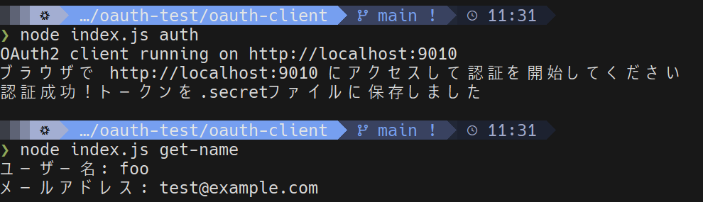

---

marp: true

---

<h1 class="center-title">OAuth 2.0 を利用したアプリケーションの作成</h1>

---

# Oauth 2.0とは

  

  

  

  

  ユーザー（リソースオーナー）がサードパーティのアプリケーションにユーザー情報（リソース）へのアクセスを許可するためのフレームワーク
  https://www.rfc-editor.org/rfc/rfc6749

  

---

# 作成したアプリ概要

Oauth 2.0の認可コードフローを利用して、アプリケーションがユーザーの名前とメールアドレスを取得する

---

# 認証、認可フロー （認可コードフロー）

  

---

# 認証、認可フロー

  

---

# 認証、認可フロー

  

---

# 認証、認可フロー

  

---

# 認証、認可フロー

  

---

# 認証、認可フロー

  

---

# 認証、認可フロー

  

---

# 認証、認可フロー

  

---

# 認証、認可フロー

  

---

# 認証、認可フロー

  

---

# リソース取得フロー

  

---

# リソース取得フロー

  

---

# リソース取得フロー

  

---

# リソース取得フロー

  

---

# リソース取得フロー

  

---

# リソース取得フロー

  

---

# 使用ツール

- Ruby on Rails：リソースサーバー

- Ory Hydra：認可サーバー

- Node.js：クライアントアプリケーション

---

<h1 class="center-title">デモ</h1>

---

クライアントアプリケーション（Node.js）
- index.js

認証、認可フロー画面（Ruby on Rails）
- oauth_login_controller.rb（ログイン画面ロジック）
- oauth_login_show.html.erb（ログイン画面ビュー）
- oauth_consent_controller.rb（認可画面ロジック）
- oauth_consent_show.html.erb（認可画面ビュー）

ユーザー情報取得API（Ruby on Rails）
- api_user_controller.rb

Hydraリクエスト（Ruby on Rails）
- hydra_service.rb
